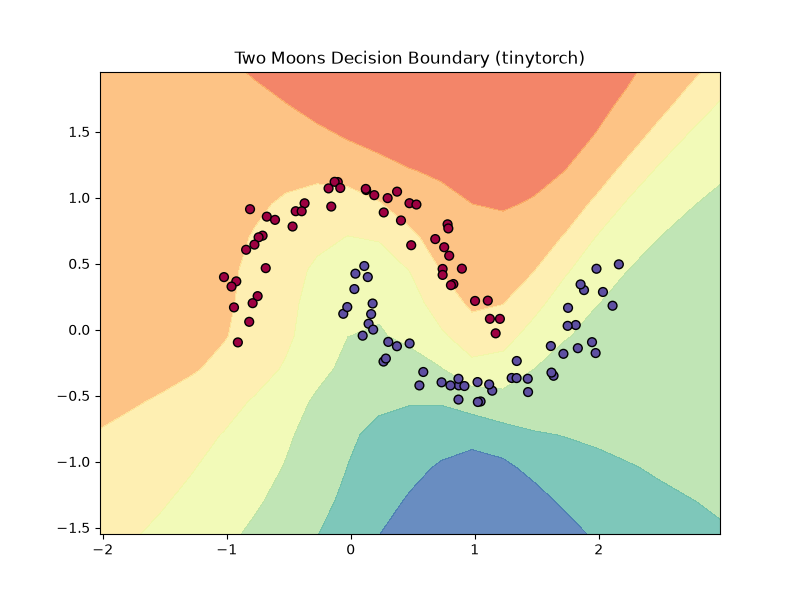

# tinytorch

A from-scratch, reverse-mode **automatic differentiation engine** that grows into a vectorised neural network library, trains a Multi-Layer Perceptron (MLP), and is benchmarked apples-to-apples against PyTorch. Built micrograd-style, this repository is designed to demonstrate a deep, systems-level understanding of backpropagation, tensor operations, and broadcasting-aware gradient computation.

---

## 1. What is autodiff, and why reverse mode?

Automatic differentiation (autodiff) evaluates the derivatives of a function by traversing its computational graph. By applying the chain rule of calculus at the operations level, it avoids the truncation errors of numerical differentiation (finite differences) and the exponential expression explosion of symbolic differentiation.

### The Advantage of Reverse Mode

For a function $f: \mathbb{R}^n \to \mathbb{R}^m$, autodiff can be run in two modes:
1. **Forward Mode**: Computes the derivatives of all outputs with respect to a single input. Requires $O(n)$ passes.
2. **Reverse Mode**: Computes the derivatives of a single output with respect to all inputs. Requires $O(m)$ passes.

In deep learning, we optimize a single scalar loss ($m = 1$) with respect to millions of model parameters ($n \gg 1$). Reverse-mode automatic differentiation computes the gradient of the loss with respect to every single parameter in a **single backward pass**, traversing the computational graph from output to input. This makes it the computational backbone of modern deep learning.

---

## 2. Design of the Engine

The engine is built around a unified computational graph node representation. It consists of two classes: `Value` (for scalar arithmetic) and `Tensor` (for multi-dimensional array arithmetic using NumPy).

```
[Input A] ---\
              +--> [Operation Node (+, *, tanh)] ---> [Output C]
[Input B] ---/
```

### The Node State
Each node stores:
- `data`: The forward value (scalar or NumPy `ndarray`).
- `grad`: The accumulated gradient ($\partial \text{loss} / \partial \text{node}$). Starts at zero.
- `_backward`: A closure defined during the forward pass. Calling it applies the local derivative rule and propagates the gradient to the inputs.
- `_prev`: References to parent nodes (graph edges).
- `_op`: String label for graph inspection.

### Core Mechanics
1. **The Three-Step Op Pattern**:
   Each mathematical operation (like `__add__` or `__mul__`) follows this pattern:
   - **Compute**: Compute `out_data`.
   - **Record**: Construct the output node registering parent nodes as `_children` and marking the operation.
   - **Closure**: Define a `_backward` function that reads the downstream gradient (`out.grad`), scales it by the local derivative, and **accumulates** (`+=`) it into the parents' `.grad`.
2. **Gradient Accumulation**:
   We use `+=` (not `=`) to accumulate gradients. This ensures that if a node is reused in multiple paths, its gradients sum correctly (preventing the multiple-use overwrite bug).
3. **Reverse Topological Ordering**:
   Before running backpropagation, we build a topological sort of the graph using a depth-first search (DFS) post-order traversal. Backpropagation is executed by seeding the root node gradient to `1.0` and traversing the sorted nodes in reverse order, ensuring every consumer executes its `_backward` step before its producers are read.
4. **Broadcasting-Aware Backward**:
   When adding a bias of shape `(10,)` to a batch of activations of shape `(32, 10)`, NumPy automatically broadcasts the bias. To backpropagate, we sum-reduce the incoming gradient along prepended and size-1 dimensions back to the original input shape.

---

## 3. Results & Benchmarks

### Two-Moons Classification (MLP)
We trained a scalar-based MLP containing two hidden layers of 16 neurons on the synthetic two-moons classification dataset. Using a max-margin (SVM) loss and hand-rolled SGD, the model successfully separate the classes with **100.0% training accuracy**. L2 regularization keeps the decision boundary smooth and generalized:



### MNIST Handwritten Digits Benchmark
We trained a vectorised three-layer MLP (784 inputs $\to$ 128 hidden $\to$ 10 outputs) on a subset of the MNIST dataset (1,000 training images, 200 test images) for 10 epochs using our custom `Adam` optimizer and a numerically stable `cross_entropy` loss (log-sum-exp).

We benchmarked `tinytorch` against an identical architecture implemented in `PyTorch` (apples-to-apples initialization, batch size of 100, and identical hyperparameters):

| Engine | Test Accuracy | Time (Seconds) |
|---|---|---|
| **`tinytorch`** (NumPy-backed) | **92.5%** | **0.6509s** |
| **`PyTorch`** (C++ Autograd) | **93.0%** | **0.0895s** |

### Analyzing the Speed Gap
`PyTorch` is **7.2x faster** than `tinytorch` on this benchmark. 
This difference is a core teaching result of ML systems:
- `tinytorch` executes Python code (interpreting instructions, creating Python `Tensor` objects, and defining lambda closures) for every node in the graph during the forward pass.
- `PyTorch` offloads graph construction and tensor operations to a pre-compiled, highly optimized C++ backend. The C++ runtime manages memory buffers directly and runs fused kernel operations, bypassing Python interpreter overhead.

---

## Setup & Replication

Built and tested with **Python 3.14.0**.

### 1. Environment Setup
```powershell
python -m venv .venv
.venv\Scripts\Activate.ps1      # Windows PowerShell
pip install -r requirements.txt
```

### 2. Run the Verification Tests
Runs the 32 verification tests including scalar/tensor finite-difference gradient checks:
```powershell
python -m pytest
```

### 3. Replicate Two-Moons Training
Trains a scalar MLP on two-moons and plots the decision boundary to `assets/moons_decision_boundary.png`:
```powershell
python -m examples.train_moons
```

### 4. Replicate MNIST & PyTorch Benchmarks
Install PyTorch and run both training runs:
```powershell
# Install PyTorch
pip install -r requirements-bench.txt

# Run tinytorch training
python -m examples.train_mnist

# Run PyTorch baseline
python -m benchmarks.pytorch_baseline
```
